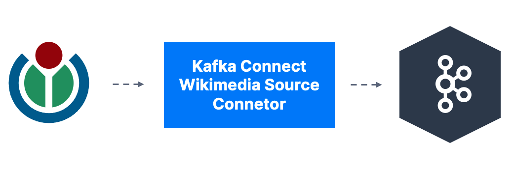

# Kafka Connect Wikimedia

Simple Kafka Connect Source connector to take a [data streams from wikimedia](https://stream.wikimedia.org/v2/stream/recentchange) and insert it into a Kafka topic

## Running

Download the jar at https://github.com/conduktor/kafka-connect-wikimedia/releases

Use the configuration file at [connector/wikimedia.properties](connector/wikimedia.properties)

## Building

Execute the 'shadowJar' command in Gradle

This will build a `build/libs/kafka-connect-wikimedia-1.0-all.jar` file

Then put this in your Kafka Connect connectors directory and configure a properties file to start the connector

# By Conduktor

[Conduktor](https://www.conduktor.io) is about making Kafka accessible to everyone. Check out our free Kafka learning website [Kafkademy](https://kafkademy.com/) and our Apache Kafka Desktop Client [Conduktor DevTools](https://conduktor.io/download)

